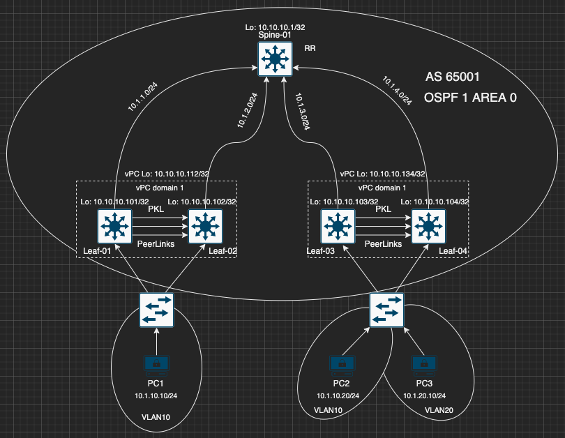

# Ansible-Netconf: Network as Code

## Goals and Methods
This repository aims to configure 2-Clos Design(Spine-Leaf) datacenter architecture with Vxlan as overlay technology and BGP EVPN as control plane technology using Ansible with Netconf.
Topology is included with 5 NX9K switches. One of them is Spine and the other ones are Leaf switches.
Leaf-01 and Leaf-02 as well as Leaf-03 and Leaf-04 switches are designed as vPC peers to also simulate vPC consideration for Vxlan BGP EVPN deployment.
iBGP is used for this design and Spine switch is configured as Route Reflector.
Ingress replication protocol is BGP.
Symmetric IRB is used for L3 Routing.

## Topology


### Topology Notes
- All address schemas can be seen in topology.
- PC1 and PC2 are in same domain which is Vlan 10 and PC3 is in another domain which is Vlan 20.
- PC1 and PC2 should reach each other and SHOUL NOT reach with other domain.
- vPC loopback is secondary IP address for loopback 0 interfaces on vPC peers.
- Eth1/5 is used as peer keepalive link and Eth1/6 and Eth1/7 are used as peer links in vPC domain.
- Eth1/1 is the connection to Spine on all Leaf switches
- Eth1/2 is host connection on all Leaf Switches

## Design
- Main configuration is divided into 2 steps. Spines configuration and Leafs configuration.
- Project is designed to configure devices with Netconf as generic as possible. Thus, there are multiple configuration steps and these are located under `roles` directory. 
- Role namings are based on configuration types.
- Every configuration role has its own `tasks`, `templates` and `files` folder. Tasks for configuration steps can be found at `roles/<config_name>/tasks/main.yaml`.
- Every configuration step task firstly generate the xml configuration file based on the group/host variables from `roles/<config_name>/templates/` location and save it under `roles/<config_name>/files/` with the unique names for every inventory host.
- Generated xml configuration files are then used for configuring devices via Netconf connection in the second step of role tasks.

## Usage
1. Create your own network topology and address schemas as well as management ip addresses for ansible to communicate.
> NXOS9.3(3) is used in this project. Startup-configuration for devices are only included with management ip addresses and enabled netconf feature.
2. Clone the repo to your local directory and access it:
```bash
git clone https://github.com/EnginEken/ansible-netconf.git
```
3. Install the requirements:
```bash
pip3 install -r requirements.txt
```
4. Edit the necessary files like *hosts.yaml, group/host_vars* based on your local workstation topology requirements
5. Run the playbook:
```bash
ansible-playbook -i hosts.yaml vxlan_network_deploy.yaml
```

## ToDo
- [ ] Getting backup configurations before starting to configure devices
- [ ] Implementing `confirm_commit` and `confirm_timeout` values.