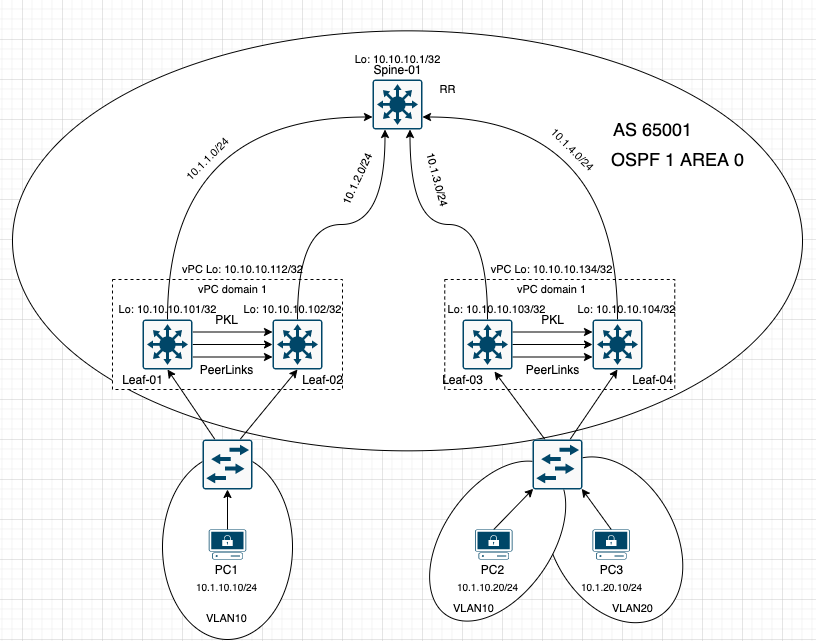

# Ansible-Netconf: Network as Code

## Goals and Methods
This repository aims to configure 2-Clos Design(Spine-Leaf) datacenter architecture with Vxlan as overlay technology and BGP EVPN as control plane technology using Ansible with Netconf.
Topology is included with 5 NX9K switches. One of them is Spine and the other ones are Leaf switches.
Leaf-01 and Leaf-02 as well as Leaf-03 and Leaf-04 switches are designed as vPC peers to also simulate vPC consideration for Vxlan BGP EVPN deployment.
iBGP is used for this design and Spine switch is configured as Route Reflector.
Ingress replication protocol is BGP.
Symmetric IRB is used for L3 Routing.

## Topology

### Topology Notes
- All address schemas can be seen in topology.
- PC1 and PC2 are in same domain which is Vlan 10 and PC3 is in another domain which is Vlan 20.
- PC1 and PC2 should reach each other and SHOUL NOT reach with other domain.
- vPC loopback is secondary IP address for loopback 0 interfaces on vPC peers.
- Eth1/5 is used as peer keepalive link and Eth1/6 and Eth1/7 are used as peer links in vPC domain.
- Eth1/1 is the connection to Spine on all Leaf switches
- Eth1/2 is host connection on all Leaf Switches